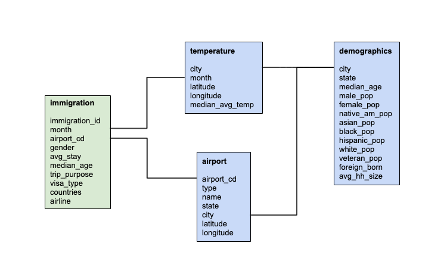

## Top of the Lake
### Udacity Data Engineering Capstone Project
### Project Summary
Combining immigration, travel, weather, and demographics data sources to create a data model for further analysis into foreign tourism to the United States.

Table of Contents:
* Scope and Data
* Exploratory Data Analysis
* Data Model
* Extract Transfer Load
* Conclusion

### Scope and Data
The project combines four datasets covering immigration and travel, weather, and city demographics.
- [I94 Immigration Data](https://travel.trade.gov/research/reports/i94/historical/2016.html): 2016 Immigration data to the United States from the U.S. National Tourism and Trade Office
- [World Temperature Data](https://www.kaggle.com/berkeleyearth/climate-change-earth-surface-temperature-data): Earth surface temperature data from Kaggle
- [U.S. City Demographic Data](https://public.opendatasoft.com/explore/dataset/us-cities-demographics/information/): Demographics of all U.S. cities and census-designated places with a population greater or equal to 65,000
- [Airport Code Table](https://datahub.io/core/airport-codes#data): Airport codes and their corresponding cities

Data is modeled using a **data lake** hosted on Amazon Web Services (AWS). Data is first loaded and processed into dimension and analytics tables using Spark and **schema-on-read**. The data is then saved to S3 as partitioned `parquet` files to be easily loaded back into Spark dataframe objects on demand. For the saved analytics tables, a **snowflake schema** of one fact table with accompanying dimension tables is used. The Spark process is deployed on an AWS EMR cluster.

### Exploratory Data Analysis

Helper functions used in Spark UDFs:
- `convert_date`: convert SAS date to datetime object
- `map_trip_purpose`: map immigration trip purpose integers to strings
- `calc_median`: calculate median from list of values
- `cel_to_fah`: convert Celsius to Fahrenheit
- `convert_latlong`: convert cardinal directions to +/- latitude and longitude coordinates

**Immigration**
Transformations:
- Selected and cast variables to correct data types
- Dropped duplicate records
- Filtered to air entry mode only
- Removed unknown/unidentified entry ports
- Converted arrival and departure variables to date fields before creating a length of stay variable
- Converted trip purpose to a string field
- Replaced 'X' in the gender field with None
- Dropped fields no longer needed

Data is aggregated by month and airport. When appropriate MapType field structuring is used to further segment aggregations by variable. For example, the gender field has been converted to a MapType in which Male and Female are keys and visit counts are values. Other aggregations include the average length of stay and the median visitor age.

After aggregating immigration data, each individual grouping is combined into one analytical table. The Spark `monotonically_increasing_id` function is used to create a unique primary key.

**Airport**
Transformations:
- Dropped rows with null IATA code
- Filtered to U.S. airports
- Split the coordinates field to create separate latitude and longitude fields
- Extracted the state code from the iso_region field by splitting on a hyphen
- Selected and cast needed variables
- Dropped duplicate records

**Demographics**
Transformations:
- Selected, cast, and renamed desired data fields
- Created a pivot table on race, grouping by city and state
- Merged the two tables to create one dimension table

**Temperature**
Transformations:
- Filtered to U.S. records
- Converted the `dt` field to datetime
- Filtered to records since 1950
- Dropped any record missing an average temperature
- Selected, cast, and renamed useful fields
- Converted the average temperature field from Celsius to Fahrenheit
- Dropped duplicate records
- Calculated the median average temperature by month, city, and lat/long coordinates

### Data Model
A **data lake** using a snowflake schema-on-read approach is utilized due to the multiple levels of relationships between dimension tables. From a centralized immigration fact table, airport, city demographics, and temperature dimension tables are interconnected, forming one-to-many relationships.



#### Fact Table
**immigration**
- immigration_id: long
- month: integer
- airport_cd: string
- gender: map
    - key: string
    - value: integer
- avg_stay: double
- median_age: double
- trip_purpose: map
    - key: string
    - value: integer
- visa_type: map
    - key: string
    - value: integer
- countries: map
    - key: integer
    - value: integer
- airlines: map
    - key: string
    - value: integer

#### Dimension Tables
**airport**
- airport_cd: string
- type: string
- name: string
- state: string
- city: string
- latitude: double
- longitude: double

**demographics**
- city: string
- state: string
- median_age: double
- male_pop: integer
- female_pop: integer
- native_am_pop: integer
- asian_pop: integer
- black_pop: integer
- hispanic_pop: integer
- white_pop: integer
- veterans: integer
- foreign_born: integer
- avg_hh_size: double

**temperature**
- month: integer  
- city: string  
- latitude: double  
- longitude: double  
- median_avg_temp: double  

### Extract Transfer Load

The data pipeline is centered around Spark and AWS EMR and consists of the following steps:
1. Copy raw data files, `etl.py`, and `install_python_modules.sh` to S3
2. Using Infrastructure-as-Code (IaC), create a new EMR cluster with Spark installed
3. Copy the ETL pipeline from S3 onto the EMR cluster
4. Submit the ETL pipeline to `spark-submit` to perform data transformations and save output tables to S3
5. Terminate the EMR cluster

To execute the pipeline, run the following scripts:
- `copy_to_s3.py`: copy raw data files, `etl.py`, and `install_python_modules.sh` to S3
- `emr.py`: create an EMR cluster, move the `etl.py` pipeline script from S3 onto the cluster, execute the pipeline using `spark-submit`

**Data dictionary**  

`immigration`

| column name    | data type | description | origin |
| -------------- | --------- | ----------- | ------ |
| immigration_id | long | monotonically increasing and unique ID | PySpark generated |
| month | integer | integer representation of month of the year | 2016 I-94 immigration data |
| airport_cd | string | IATA airport code | 2016 I-94 immigration data |
| gender | map (key: string, value: integer) | visit counts by gender in key value pairs | 2016 I-94 immigration data |
| avg_stay | double | average length of stay in days | 2016 I-94 immigration data |
| median_age | double | median age of visitors | 2016 I-94 immigration data |
| trip_purpose | map (key: string, value: integer) | visit counts by trip purpose in key value pairs | 2016 I-94 immigration data |
| visa_type | map (key: string, value: integer) | visit counts by visa type in key value pairs | 2016 I-94 immigration data |
| countries | map (key: string, value: integer) | visit counts by country of origin in key value pairs | 2016 I-94 immigration data |
| airlines | map (key: string, value: integer) | visit counts by airline in key value pairs | 2016 I-94 immigration data |


`airport`

| column name    | data type | description | origin |
| -------------- | --------- | ----------- | ------ |
| airport_cd | string | IATA airport code | airport location information and attributes dataset from datahub.io |
| type | string | type of airport (small, medium, large) | airport location information and attributes dataset from datahub.io |
| name | string | airport name | airport location information and attributes dataset from datahub.io |
| state | string | two letter U.S. state code of airport location | airport location information and attributes dataset from datahub.io |
| city | string | U.S. city of airport location | airport location information and attributes dataset from datahub.io |
| latitude | double | latitudinal coordinate of airport location | airport location information and attributes dataset from datahub.io |
| longitude | double | longitudinal coordinate of airport location | airport location information and attributes dataset from datahub.io |


`demographics`

| column name    | data type | description | origin |
| -------------- | --------- | ----------- | ------ |
| city | string | U.S. city name | city demographics data from the U.S. Census Bureau's 2015 American Community Survey |
| state | string | two letter U.S. state code | city demographics data from the U.S. Census Bureau's 2015 American Community Survey |
| median_age | double | median age of city resident | city demographics data from the U.S. Census Bureau's 2015 American Community Survey |
| male_pop | integer | male population | city demographics data from the U.S. Census Bureau's 2015 American Community Survey |
| female_pop | integer | female population | city demographics data from the U.S. Census Bureau's 2015 American Community Survey |
| native_am_pop | integer | native american population | city demographics data from the U.S. Census Bureau's 2015 American Community Survey |
| asian_pop | integer | asian population | city demographics data from the U.S. Census Bureau's 2015 American Community Survey |
| black_pop | integer | african american population | city demographics data from the U.S. Census Bureau's 2015 American Community Survey |
| hispanic_pop | integer | hispanic population | city demographics data from the U.S. Census Bureau's 2015 American Community Survey |
| white_pop | integer | caucasian population | city demographics data from the U.S. Census Bureau's 2015 American Community Survey |
| veterans | integer | number of veterans | city demographics data from the U.S. Census Bureau's 2015 American Community Survey |
| foreign_born | integer | number of foreign born residents | city demographics data from the U.S. Census Bureau's 2015 American Community Survey |
| avg_hh_size | double | average household size | city demographics data from the U.S. Census Bureau's 2015 American Community Survey |


`temperature`

| column name    | data type | description | origin |
| -------------- | --------- | ----------- | ------ |
| month | integer | integer representation of month of the year | 1950-2013 temperature data from the Berkeley Earth Surface Temperature Study |
| city | string | U.S. city name | 1950-2013 temperature data from the Berkeley Earth Surface Temperature Study |
| latitude | double | latitudinal coordinate of city | 1950-2013 temperature data from the Berkeley Earth Surface Temperature Study |
| longitude | double | longitudinal coordinate of city | 1950-2013 temperature data from the Berkeley Earth Surface Temperature Study |
| median_avg_temp | double | median average temperature | 1950-2013 temperature data from the Berkeley Earth Surface Temperature Study |


**Data Quality Checks**  
A variety of data quality checks have been performed to ensure data integrity and completeness. All quality checks ensure data has been aggregated correctly, dimension and analytical tables are populated with the correct data, data types match expectations, and table joins are successful. The following are examples data quality checks performed to verify the data pipeline ran and processed the data according to the predefined data model.

``` python
# nulls
immigration_table.select([f.count(f.when(f.col(c).isNull(), c)) \
    .alias(c) for c in immigration_table.columns]).toPandas()
```
``` python
# duplicates
immigration_table.groupBy("airport_cd").count() \
    .filter("count >= 2") \
    .count()
```
``` python
# integrity
temp_table.select(f.col('month')).distinct().count() == 12
```
``` python
# joins
immigration_table.join(airport_table,
    on=[immigration_table.airport_cd == airport_table.airport_cd]) \
    .select(
        immigration_table.month,
        airport_table.airport_cd) \
    .distinct().count()
```


### Conclusion
The project relies heavily on Apache Spark and AWS. A data lake model was chosen for the following reasons:
1. On-demand cloud-based technologies are easily scaled and can cut down on processing costs and overhead
2. Spark is best-in-class for big data processing, and allows for advanced downstream analytics and machine learning
3. Schema-on-read supports the ingestion of all data formats, regardless of perceived value

Data has been aggregated at the city and month level. As such, it is recommended that data be refreshed and updated on a monthly cadence. As the data is designed to inform marketing and advertising considerations, monthly updates should be sufficient to capture key changes in the underlying data.

**Scenarios**  
1. The data increased by 100x
> The selected data model lends itself kindly to sudden and significant increases in data size. Spark's distributed processing engine combined with AWS elastic computing can easily handle an increase in data by 100x.

2. The data populates a daily-updated dashboard
> The intended purpose of the selected data model is to provide data aggregated by month and city. However, current month statistics could be recalculated on a daily basis as new data becomes available. The likelihood of new data holding sway over pre-computed statistics is low, but a daily refresh would be fairly straight forward to implement using the existing data pipeline and a ETL pipelining tool such as Apache Airflow.

3. The database is accessed by 100+ people
> Because the project employs a data lake model, a relational database is not relevant. The data pipeline will construct analytics tables and then save the output as parquet files to S3. These files can then be accessed by anyone with S3 read permissions.
